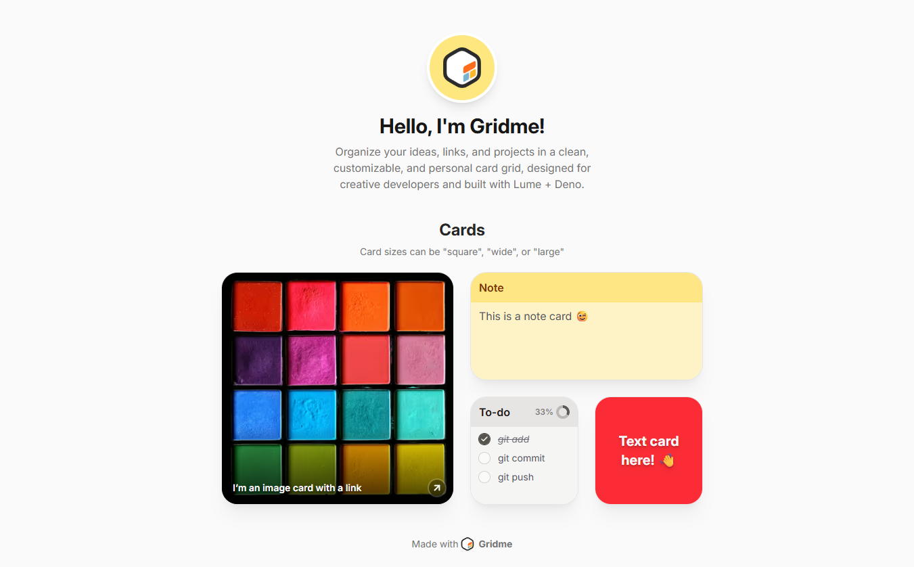

#  gridme

<p align="center">
  A flexible link hub theme for Lume, inspired by bento.me.
</p>

<p align="center">
  <!-- Preview -->
  
</p>

## Overview

**gridme** is a theme for [Lume](https://lume.land), a static site generator for
Deno.

It provides a clean, card-based interface for building a personal link hub. It
is inspired by **bento.me**, a platform discontinued after its acquisition by
Linktree.

You can display:

- Links
- Images
- Maps
- Notes and text
- Dynamic content cards (Smart Cards)

## 📦 Tech Stack

- **Deno** — runtime environment
- **Lume** — static site generator
- **TypeScript** — configuration and logic
- **Tailwind CSS** — styling and layout

## Installation

### Requirements

- Deno installed

### 1. Create a Lume project

```sh
deno run -A https://lume.land/init.ts
```

### 2. Install as a remote theme

Add the following to your `_config.ts`:

```ts
import lume from "lume/mod.ts";
import gridme from "https://cdn.jsdelivr.net/gh/wfrancescons/gridme@0.1.1/mod.ts";

const site = lume();

site.use(gridme());

export default site;
```

### 3. Run the project

```sh
deno task serve
```

Then follow the instructions shown in the browser.

## Components

Components define how content is structured and displayed. They are configured
using YAML.

All cards require a `size` property with one of the following values: `square` |
`wide` | `large`.\
Sections do not require a size.

| YAML Key   | Description                          | Required Options     | Optional Options        | Accepted Values                                                                                                                        |
| ---------- | ------------------------------------ | -------------------- | ----------------------- | -------------------------------------------------------------------------------------------------------------------------------------- |
| `section`  | Groups cards into categories         | —                    | `subtitle`              | —                                                                                                                                      |
| `image`    | Displays an image with optional link | `src`                | `alt`, `caption`, `url` | —                                                                                                                                      |
| `note`     | Simple highlighted note              | `content`            | —                       | —                                                                                                                                      |
| `todo`     | Checklist-style card                 | `items`              | —                       | `items`: array of `{ text: string, completed?: boolean }`                                                                              |
| `text`     | Text content with styling            | `content`            | `color`, `textSize`     | `color`: `amber` \| `blue` \| `green` \| `red` \| `purple` \| `neutral`<br>`textSize`: `small` \| `medium` \| `large` \| `extra-large` |
| `folder`   | Groups multiple components           | `name`, `components` | `color`                 | `color`: same as `text`                                                                                                                |
| `link`     | Smart preview of a URL               | `url`                | —                       | —                                                                                                                                      |
| `map`      | Displays a map location              | `center`             | `zoom`, `caption`       | `center`: `[lng, lat]` (max 3 decimal places)                                                                                          |
| `telegram` | Telegram integration card            | `url`                | —                       | —                                                                                                                                      |

## Example Configuration

```yaml
components:
  - section: Cards
    subtitle: Card sizes can be "square", "wide", or "large"

  - image:
      size: large
      src: https://wfrancescons.gridme.bio/img/lastfm-grid-600w.avif
      alt: Alt text for your image
      caption: I’m an image card with a link
      url: https://unsplash.com/

  - note:
      size: wide
      content: This is a note card 😉

  - todo:
      size: square
      items:
        - text: git add
          completed: true
        - text: git commit
        - text: git push

  - text:
      size: square
      content: Text card here! 👋
      color: red
      textSize: extra-large

  - folder:
      name: I'm a folder
      components:
        - text:
            size: wide
            content: Inside a folder 🗂️
```

## Smart Cards

Smart cards automatically render content based on input data.

Examples include:

- `link` (URL preview)
- `map` (location visualization)
- `telegram` (external integration)

## Notes

- Card sizes: `square`, `wide`, `large`
- Sections do not require size
- Do not use more than 3 decimal places in map coordinates
